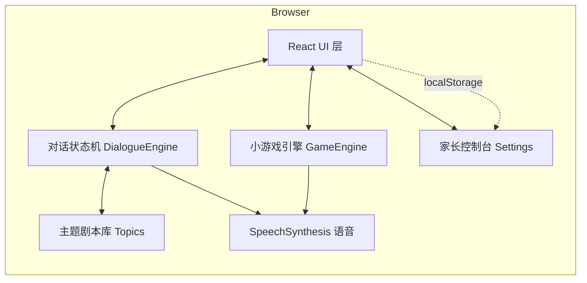
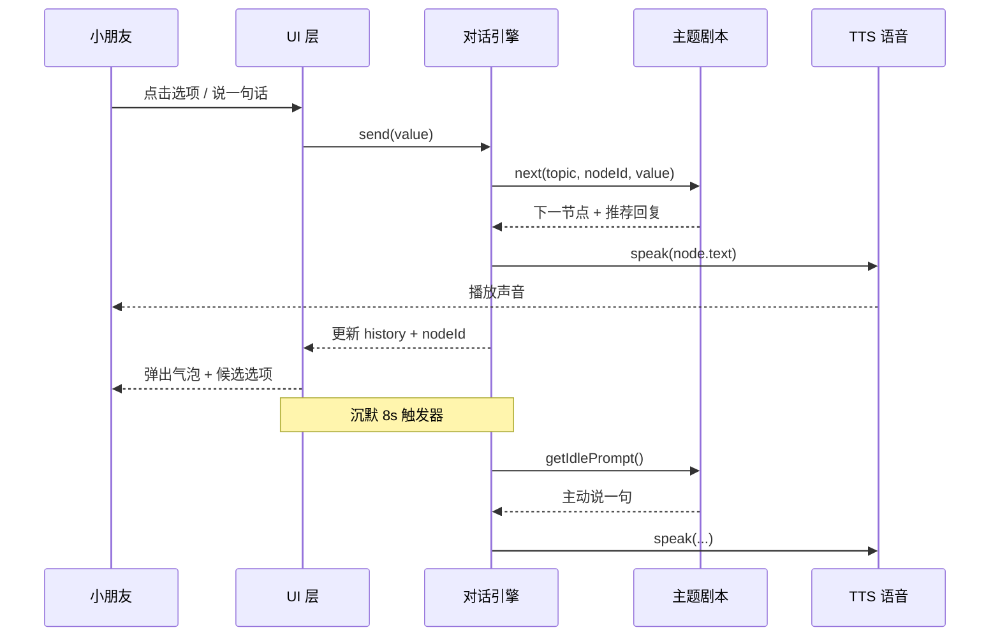

# 技术架构：童语星球 · AI 主动陪聊小伙伴（KidBot）

## 1. 架构设计

本项目为**纯前端 Web 应用**（无后端、无数据库），所有 AI 对话逻辑在浏览器内通过**对话状态机 + 主题剧本库**模拟实现，确保离线可玩、隐私安全、0 成本演示。TTS 使用浏览器内置 `SpeechSynthesis` API。



- **零后端**：避免引入 API Key / 计费，所有"AI 主动话题"由 6 个主题剧本 + 状态机模拟。
- **零外部资源**：emoji 用系统字体，插画用纯 SVG / CSS 绘制，首屏无外网依赖。
- **可扩展**：未来可把 `Topics` 模块替换为 LLM API 调用，前端不动一行。

## 2. 技术说明

| 项 | 选型 | 理由 |
|----|------|------|
| 框架 | React 18 + TypeScript | 类型安全、组件化、生态成熟 |
| 构建 | Vite 5 | 启动快、HMR 流畅 |
| 样式 | Tailwind CSS 3 + CSS 变量 | 快速原型 + 主题色集中管理 |
| 状态 | Zustand | 比 Redux 轻，状态机/家长设置均适合 |
| 路由 | 不需要（单页 + 模态） | 4 岁小朋友操作，越简单越好 |
| 语音 | 浏览器 `SpeechSynthesis` | 零依赖、支持中文 |
| 持久化 | `localStorage` | 仅家长设置项，数据量极小 |
| 测试 | 不引入（演示项目） | PRD 已定义核心流程，UI 自检即可 |
| 代码规范 | ESLint + Prettier（vite 默认模板） | 保持一致 |

### 2.1 目录结构
```
kidbot/
├── index.html
├── package.json
├── vite.config.ts
├── tailwind.config.js
├── postcss.config.js
├── tsconfig.json
└── src/
    ├── main.tsx                # 入口
    ├── App.tsx                 # 顶层页面：欢迎 / 陪伴 / 告别
    ├── index.css               # Tailwind 注入 + 全局动画
    ├── components/
    │   ├── Robot.tsx           # 圆胖机器人 SVG（带眨眼/嘴巴动画）
    │   ├── Bubble.tsx          # 对话气泡（左/右）
    │   ├── InputDock.tsx       # 底部输入：语音 / 选项 / 游戏
    │   ├── GameCard.tsx        # 游戏入口大卡
    │   ├── ParentPanel.tsx     # 家长控制台
    │   └── Decorations.tsx     # 背景云朵、星星、纸飞机
    ├── games/
    │   ├── EmojiGuess.tsx
    │   ├── ColorFind.tsx
    │   └── NumberClap.tsx
    ├── engine/
    │   ├── dialogueEngine.ts   # 主动话题 / 多轮追问状态机
    │   ├── topics.ts           # 6 大主题剧本
    │   ├── gameEngine.ts       # 游戏通用循环
    │   └── stories.ts          # 迷你故事模板
    ├── store/
    │   └── useSettings.ts      # 家长设置
    └── utils/
        ├── tts.ts              # 语音封装
        └── idles.ts            # 沉默检测 / 主动说话
```

## 3. 路由定义

单页应用 + 内嵌模态，无传统路由；用 React 状态切换"页面"：

| 状态 | 路径（hash） | 用途 |
|------|---------------|------|
| `welcome` | `#/` | 启动欢迎页 |
| `chat` | `#/chat` | 主陪伴页（聊天 + 主动话题） |
| `game-emoji` | `#/game/emoji` | emoji 猜猜乐 |
| `game-color` | `#/game/color` | 颜色找一找 |
| `game-clap` | `#/game/clap` | 数字拍拍手 |
| `story` | `#/story` | 小故事播放 |
| `bye` | `#/bye` | 时长到达挥手告别页 |
| `parent` | `#/parent` | 家长控制台（模态） |

使用轻量 `hash` 路由（自实现），无需 react-router。

## 4. API 定义

无后端 API；以下为前端内部 TS 接口，作为"伪协议"约束引擎 ↔ UI：

```ts
// 主题剧本节点
type TopicNode = {
  id: string;
  text: string;                  // 机器人话语（含 emoji）
  options?: ReplyOption[];       // 2-3 个候选回复
  next?: (choice: string) => string; // 返回下一节点 id
  after?: number;                // 说 N 句后自动跳转
};

type ReplyOption = {
  label: string;     // 显示文本
  icon?: string;     // emoji 图标
  value: string;     // 用于状态机的输入
};

type DialogueState = {
  topic: string;             // 当前主题 id
  nodeId: string;            // 当前节点
  turn: number;              // 已在该主题轮了几次
  history: { from: 'bot' | 'kid'; text: string }[];
};
```

## 5. 对话引擎时序图



## 6. 数据模型

无服务端数据库；家长设置以 JSON 形式存于 `localStorage.kidbot:settings`：

```ts
type Settings = {
  dailyLimitMin: 5 | 10 | 15 | 20 | 30;     // 每日时长
  usedSeconds: number;                      // 今日已用
  quietMode: boolean;                       // 静音模式
  lastResetDate: string;                    // ISO 日期，便于跨天重置
  voiceName?: string;                       // 选中的中文 TTS 音色
  voiceRate: number;                        // 0.8-1.2
};
```

### 6.1 主题剧本（伪数据，演示用）

| 主题 | 入口节点示例 | 主动话术示例 |
|------|---------------|--------------|
| animals | "你最喜欢什么小动物呀？" | "我猜你一定喜欢小兔子！" |
| colors | "你今天穿的衣服是什么颜色呀？" | "红色像太阳，蓝色像大海～" |
| food | "你今天吃了什么好吃哒？" | "水果甜甜的，对身体好哦！" |
| family | "家里都有谁呀？" | "有爸爸妈妈陪你好幸福呀！" |
| feelings | "今天开心吗？为什么呀？" | "哭也没关系，抱抱就好了～" |
| imagine | "如果能飞，你想去哪里？" | "我想带你去云朵上滑滑梯！" |

每个主题至少 6 个节点，3 轮内必触发游戏或故事邀请。

### 6.2 小游戏数据

- **emoji 猜猜乐**：10 关，候选库 `{🐶,🐱,🐰,🐻,🐼,🦊,🐯,🦁,🐮,🐷}`。
- **颜色找一找**：6 关，4 个选项 1 个正确。
- **数字拍拍手**：5 关，目标 1–5。

每个游戏通关后机器人夸张鼓励并回到主陪伴页。
