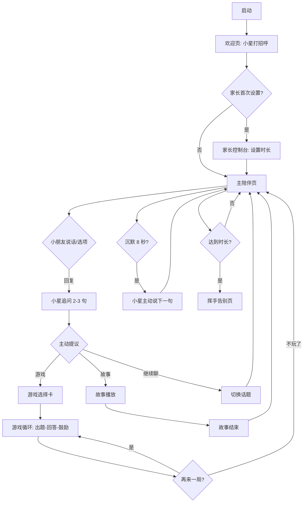

# PRD：童语星球 · AI 主动陪聊小伙伴（KidBot）

## 1. 产品概述

童语星星球（KidBot）是一款面向 **4 岁左右儿童**的 AI 主动陪聊 Web 应用，定位为小朋友的「会说话的好朋友」。机器人会主动打招呼、抛出话题、追问、讲小故事、玩小游戏，模拟一个温柔、好奇、慢节奏的玩伴。

- **核心目的**：在父母忙碌或睡前陪伴场景下，提供有温度、可中断、可玩起来的语言互动体验，启发表达、情绪认知和基础认知（颜色 / 形状 / 数字 / 动物）。
- **目标用户**：3–6 岁学龄前儿童，及其家长（家长用于首次设置、时长控制）。
- **产品价值**：相比传统故事机 / 早教机，童语星球的差异化在于「**主动**」「**多轮**」「**可玩**」——机器人不会等你按按钮，它会先说话、先提问、先抛出游戏。

## 2. 核心功能

### 2.1 用户角色
| 角色 | 进入方式 | 核心权限 |
|------|----------|----------|
| 小朋友 | 默认进入 / 大按钮"和小星玩" | 与机器人聊天、玩游戏、听故事 |
| 家长 | 长按左上角小星星 3 秒 | 设置每日时长、休息提醒、安静模式、清除对话 |

### 2.2 功能模块
1. **主陪伴页（聊天 + 游戏一体化）**：机器人形象 + 气泡对话 + 主动话题 + 内嵌游戏卡片。
2. **主题话题库**：动物 / 颜色 / 食物 / 家庭 / 情绪 / 想象 6 大主题，机器人轮换主动开启。
3. **小游戏库（3 个）**：emoji 猜猜乐、颜色找一找、数字拍拍手，每个游戏 1–2 分钟可结束。
4. **小故事模块**：机器人按"很久很久以前……"模板讲一个 30 秒的迷你故事并配音。
5. **家长控制台**：时长限制、休息提醒、安静模式（关闭声音）、清除记录。

### 2.3 页面详情
| 页面名称 | 模块名称 | 功能描述 |
|----------|----------|----------|
| 启动欢迎页 | 欢迎动画 | 机器人眨眼、说"你好呀！我是小星"并自动进入主陪伴页 |
| 主陪伴页 | 机器人区 | 中央放置机器人形象，嘴巴/眼睛/腮红随语音动画 |
| 主陪伴页 | 对话气泡区 | 机器人话语显示在左侧气泡，小朋友"输入"（提供选项 + 语音按钮 + 文字三种方式）显示在右侧 |
| 主陪伴页 | 主动话题触发器 | 沉默 8 秒后机器人自动说下一句；每轮对话 3–5 句后会抛出"想玩游戏吗？" |
| 主陪伴页 | 快捷回复选项 | 每条机器人话语下方出现 2–3 个适合 4 岁小朋友的回复选项（图标 + 短句） |
| 主陪伴页 | 游戏入口卡 | 机器人说"我们一起玩游戏吧"后弹出 3 个游戏卡片，点头像进入 |
| 小游戏：emoji 猜猜乐 | 题目展示 | 显示 3 个 emoji + 语音描述，小朋友从 3 个图片选项中选 |
| 小游戏：颜色找一找 | 题目展示 | 机器人说"找出红色的小汽车"，小朋友从 4 个彩色物体中点击 |
| 小游戏：数字拍拍手 | 题目展示 | 机器人说"拍 3 下小手"，屏幕出现拍手计数器 |
| 故事模块 | 故事播放器 | 全屏卡片翻页动画 + 文字逐行高亮 + 配音 + 背景音 |
| 家长控制台 | 时长设置 | 滑块 5/10/15/20/30 分钟；进度条显示今日已用 |
| 家长控制台 | 安静模式 | 关闭所有语音，只显示文字 |
| 家长控制台 | 清除记录 | 一键清空当前对话 |

## 3. 核心流程

### 3.1 自然语言描述
1. 小朋友打开应用，看到小星眨眼睛、挥手说"你好呀，我是小星，今天想聊什么呀？"
2. 小朋友可以点语音按钮说一句话（演示版用预设语句模拟），也可以点选项按钮快速回复。
3. 小星根据回复追问 2–3 句，然后主动提议"我们玩个游戏吧？" / "我给你讲个故事吧？" / "换个话题聊聊？"
4. 进入游戏后，游戏以"小星出题 → 小朋友选择 → 小星夸张鼓励"为循环。
5. 家长长按左上角星星进入控制台，可设置每日时长（默认 15 分钟），到时机器人说"我们下次再玩吧"并挥手告别。

### 3.2 主流程图

## 4. 用户界面设计

### 4.1 设计风格
- **整体风格**：手绘童话风 / 软糯马卡龙色，参考儿童绘本 + Pixar 角色圆润感。
- **主色板**：
  - 奶油黄 `#FFE9A8`（背景）
  - 草莓粉 `#FF8FA3`（强调色 / 按钮）
  - 薄荷绿 `#7FD8A4`（次强调 / 进度条）
  - 紫罗兰 `#B79CED`（机器人身体）
  - 焦糖棕 `#5B3A29`（文字）
- **辅色**：天空蓝 `#A8D8F0`、柠檬黄 `#FFE066`、淡灰 `#F4EEE0`。
- **按钮风格**：超大圆角（`border-radius: 24px`），带轻微投影 + 按下时"啵叽"挤压动画。
- **字体**：
  - 中文：思源黑体圆 / 演示用 `"Noto Sans SC", "PingFang SC", "Microsoft YaHei", sans-serif` 加重字号（基础 20px，标题 36–48px）。
  - 数字 / 英文：圆润手写感 `"Fredoka", "Comic Sans MS", cursive`。
- **布局风格**：单列居中，最大宽度 960px；机器人永远在中央偏上，对话气泡自下而上铺开。
- **图标 / Emoji 风格**：可爱 emoji 为主，自绘 SVG 圆胖机器人作为主形象。
- **微动效**：机器人眨眼（每 3 秒）、腮红浮动、说话时嘴巴开合、气泡弹出"咻"。

### 4.2 页面设计概览
| 页面名称 | 模块名称 | UI 元素 |
|----------|----------|---------|
| 启动欢迎页 | 中心卡片 | 大号机器人 + 渐显文字"你好呀！我是小星" + 4 颗闪烁星星装饰 |
| 主陪伴页 | 顶部状态栏 | 左侧：可隐藏的小星头像（长按 3s 进家长模式）；右侧：今日剩余时长进度条 |
| 主陪伴页 | 机器人区 | 320px 高的中央机器人（CSS / SVG 实现），底部为对话气泡流 |
| 主陪伴页 | 输入区 | 三个大按钮：[🎤 说一说] [😀 选项回复] [🎮 玩个游戏]；选项回复以图标 + 2 字短句呈现 |
| 主陪伴页 | 主动提示 | 顶部小气泡"小星正在想下一个话题…"（仅在思考时出现） |
| 游戏：emoji 猜猜乐 | 题目区 | 3 个超大 emoji 居中 + 小星语音泡"猜一猜这是什么？" + 3 张手绘图片选项 |
| 游戏：颜色找一找 | 题目区 | 4 个彩色方块（水果 / 动物 / 车） + 小星语音泡"点一点红色的小汽车" |
| 游戏：数字拍拍手 | 题目区 | 中央"👏 ×N" 大号数字 + 进度反馈"还差 1 下！" |
| 故事模块 | 翻页卡 | 全屏 4 屏翻页，每屏一句 12 字以内故事 + 背景渐变 |
| 家长控制台 | 模态卡片 | 半透明遮罩 + 圆角白卡 + 滑块 / 开关 / 按钮；密码采用"长按 3 秒"代替 |

### 4.3 响应式
- 桌面优先：1280px 居中画板，两侧留白填充装饰云朵。
- 平板 (≤1024px)：机器人缩小到 240px，选项按钮两列。
- 手机 (≤640px)：单列全屏，输入区贴底，机器人 200px。
- 触摸优化：所有可点击元素 ≥ 56×56px；按钮间距 ≥ 16px。

### 4.4 视觉装饰（绘本式氛围）
- 背景：奶油黄底 + 漂浮的云朵 SVG + 角落小植物剪影。
- 顶部状态栏右侧偶尔飘过一只小鸟或纸飞机（每 30 秒一次）。
- 切换话题时背景颜色 800ms 渐变到下一个主题色（动物→森林绿，食物→蜜橘橙）。
- 鼓励反馈：选对答案时屏幕中央炸出"✨ 太棒啦 ✨"粒子动画。
