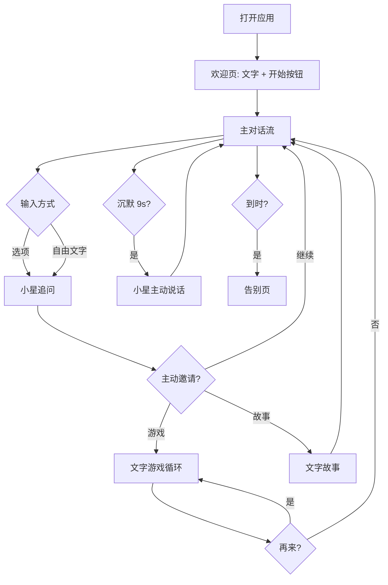

# PRD：童语星球 · AI 主动陪聊（纯语音/文字版 · KidBot V2）

## 1. 产品概述

童语星球（KidBot）是一款面向 **4 岁左右儿童**的 AI 主动陪聊应用，**最终形态是纯语音机器人**（Voice-Only / VUI）。

- **测试阶段（当前版本）**：用**文字**代替语音进行 I/O 测试，验证对话流、状态机、剧本。
  - 用户输入 → 文字（未来替换为 STT）
  - 机器人输出 → 文字（默认）+ 浏览器 TTS 语音（可关闭）
- **正式形态（未来）**：完全无屏幕 / 无键盘 / 无装饰，仅一个语音通道。

> **本版本范围**：剥离所有装饰性视觉（机器人头像、绘本背景、卡通按钮、装饰动画等），让对话流成为界面唯一主角，方便用文字快速测试对话质量。

## 2. 核心功能

### 2.1 角色
| 角色 | 进入方式 | 权限 |
|------|----------|------|
| 小朋友 | 打开即进入 | 文字聊天、玩文字游戏、听 TTS |
| 家长 | 在标题栏点 "家长" → 弹出口令/确认 | 设置每日时长、关闭语音、清空对话 |

### 2.2 功能模块（仅保留对话流相关）
1. **主对话流**：单列聊天视图，机器人主动开头 / 追问 / 邀请。
2. **主题剧本库**（保持）：6 大主题：动物 / 颜色 / 食物 / 家庭 / 情绪 / 想象。
3. **文字小游戏**（重新设计为适合纯语音的形式）：见 §2.3。
4. **文字小故事**（保留）：4 段文字翻页，机器人依次念出。
5. **家长控制**（保留但简化）：时长、关闭 TTS、清空对话。
6. **TTS 切换**：标题栏一个小按钮，默认开启。

### 2.3 页面详情（极简版）
| 区域 | 内容 |
|------|------|
| 标题栏 | 应用名 "童语星球 · 小星" ｜ 语音开关 ｜ 家长入口 |
| 对话区 | 滚动列表：左气泡=机器人、右气泡=小朋友；每条机器人话语下方显示 2-3 个候选回复（图标 + 短词） |
| 输入区 | 文字输入框 + 发送按钮；旁边一个 🎤 占位按钮（暂时只切换"我在说话"动画，未来接 STT） |
| 状态指示 | 顶部细线进度条，显示"今日已用 / 限时"；沉默 N 秒后顶部出现"小星正在想..." |

### 2.4 文字小游戏（重做：去掉视觉点击，只用问答）
| 游戏 | 玩法（纯文字） | 回合 |
|------|---------------|------|
| **猜动物** | 机器人描述一种动物（"它的耳朵长长的，爱吃萝卜"），小朋友从 3 个选项文字里挑 | 5 轮 |
| **数到 N** | 机器人说"我数 1、2、3"，小朋友跟着输入 "1 2 3"（或直接输入总数） | 4 轮 |
| **颜色问答** | 机器人说"什么东西是红色的呀？" 或 "香蕉是什么颜色的？"，小朋友从文字选项里选 | 5 轮 |

> 设计原则：游戏**不依赖任何视觉元素**，所有信息通过文字 / 语音传递；这样未来切到纯语音时，逻辑层零改动。

## 3. 核心流程

### 3.1 自然语言
1. 打开应用 → 显示欢迎文字"你好呀，我是小星"+ "开始"按钮。
2. 进入对话流 → 小星主动抛出第一个话题（动物 / 颜色...），并显示 2-3 个候选回复。
3. 小朋友点选项 / 直接输入文字 → 小星追问或邀请（"我们玩个游戏好不好呀？"）。
4. 进入游戏 → 文字问答循环：机器人出题 → 小朋友答 → 机器人鼓励。
5. 沉默 9 秒 → 小星主动挑起下一句（避免冷场）。
6. 达到每日时长 → 显示告别页。

### 3.2 主流程图

## 4. 用户界面设计（极简版）

### 4.1 设计原则
- **去装饰**：无机器人头像、无背景图、无浮动云朵、无表情大按钮。
- **对话即界面**：聊天列表占据几乎全部视口；候选回复与输入框是仅有的两个交互区。
- **可用性优先**：家长一眼能看懂设置；小朋友能看清每一句话（基础 20px，行高 1.6）。

### 4.2 视觉规范
- **背景**：`#FAF7F0`（米白），单色；无渐变、无图案。
- **文字主色**：`#2D2A26`（深炭灰）。
- **气泡**：
  - 机器人：`#FFFFFF` 白底 + 1px `#E5DFD3` 边框，左侧。
  - 小朋友：`#4F6BED` 蓝紫底，白字，右侧。
- **按钮**：
  - 主操作：`#4F6BED` 蓝紫底白字，12px 圆角，正常尺寸。
  - 次操作：透明底 + 边框 + 主色文字。
- **字体**：`"Noto Sans SC", system-ui, sans-serif`，常规字重；候选回复里的 emoji 字号略大。
- **不引入**：渐变、阴影、贴纸、动画（除气泡进入的 200ms 淡入外）。

### 4.3 响应式
- 桌面（≥768px）：居中列宽 720px，两侧留白。
- 手机（<768px）：全宽，贴底输入。

### 4.4 视觉装饰
- 仅 1 个：发送消息时，输入框右上角短暂出现一个 1.5s 的小圆点（"小星收到啦"），然后淡出。
- 仅此而已。

## 5. 与 V1 版的差异（变更摘要）
| 项 | V1（绘本风） | V2（纯语音/文字测试版） |
|----|--------------|--------------------------|
| 机器人形象 | 大 SVG 圆胖机器人 | 无 |
| 背景 | 渐变 + 浮动云朵 | 单色米白 |
| 按钮 | 大圆胖彩色按钮 | 标准尺寸、克制配色 |
| 游戏 | 视觉点击（点图片） | 文字问答 |
| 故事 | 翻页大卡 | 纯文字 + TTS |
| 家长入口 | 长按左上角 3s | 点击标题栏 "家长" 文字 |
| TTS | 始终开启 | 标题栏可关闭 |
| 装饰 | 漂浮纸飞机、闪烁星星 | 仅 1 个微动效 |
| 主动说话 | 沉默 9s | 同上（保留） |

## 6. 非目标（本版不做）
- 真实 STT 接入（按 🎤 仅做"我在说话"动画占位）。
- 真实 LLM 接入（仍用剧本 + 状态机）。
- 多角色 / 多语言。
- 账号、登录、付费、统计。
