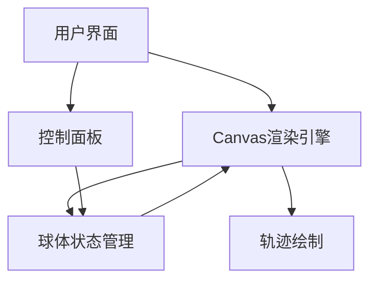

## 1. Architecture Design


## 2. Technology Description
- 前端: 原生HTML5 + Canvas + JavaScript
- 样式: 原生CSS3
- 构建工具: 无需构建工具，直接使用HTML/CSS/JS

## 3. Route Definitions
| Route | Purpose |
|-------|---------|
| / | 游戏主页面 |

## 4. API Definitions
不需要后端API

## 5. Server Architecture Diagram
不需要后端

## 6. Data Model
不需要数据库，使用内存状态管理

### 6.1 状态定义
```javascript
{
  x: number, // 球体X坐标
  y: number, // 球体Y坐标
  path: [{x: number, y: number}], // 轨迹点数组
  minDistance: number, // 最小移动距离
  maxDistance: number, // 最大移动距离
  refreshRate: number, // 刷新频率(毫秒)
  isRunning: boolean // 游戏是否运行中
}
```

