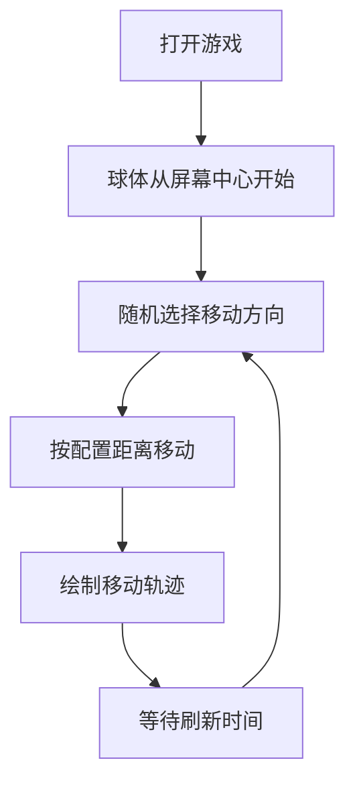

## 1. Product Overview
随机球移动游戏，一个红色球体从屏幕中心随机移动，同时绘制移动轨迹。

## 2. Core Features

### 2.1 User Roles
不需要用户角色

### 2.2 Feature Module
1. **游戏主页面**: 红色球体、控制面板

### 2.3 Page Details
| Page Name | Module Name | Feature description |
|-----------|-------------|---------------------|
| 游戏主页面 | 红色球体 | 在屏幕中央，随机移动，上下左右移动概率相同，移动距离在0.1~0.5之间可配置，刷新频率0.2秒 |
| 游戏主页面 | 移动轨迹 | 用线条画出红色球体的移动路径 |
| 游戏主页面 | 控制面板 | 可配置移动距离范围、刷新频率，可暂停/开始游戏 |

## 3. Core Process
用户打开游戏 -> 红色球体从屏幕中心开始随机移动 -> 自动绘制移动轨迹 -> 用户可通过控制面板调整参数或暂停游戏

## 4. User Interface Design
### 4.1 Design Style
- 主背景：深色背景，简洁风格
- 球体：亮红色，带光晕效果
- 轨迹：半透明红色线条
- 控制面板：白色文字，简洁设计
- 布局：全屏Canvas，控制按钮在底部
### 4.2 Page Design Overview
| Page Name | Module Name | UI Elements |
|-----------|-------------|-------------|
| 游戏主页面 | Canvas区域 | 深色背景，红色球体，红色轨迹 |
| 游戏主页面 | 控制面板 | 配置移动距离滑块，配置刷新频率滑块，开始/暂停按钮，重置按钮 |
### 4.3 Responsiveness
桌面优先，自适应不同屏幕尺寸

